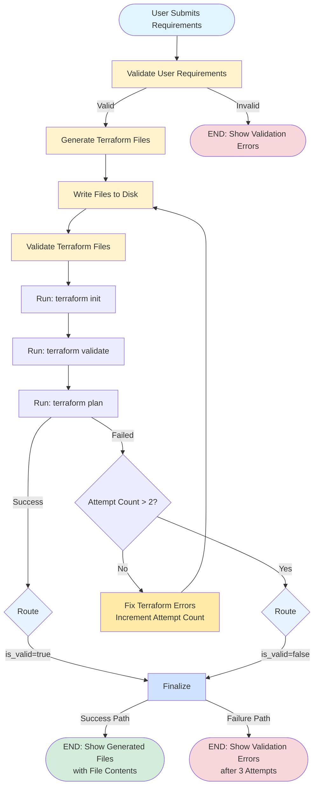
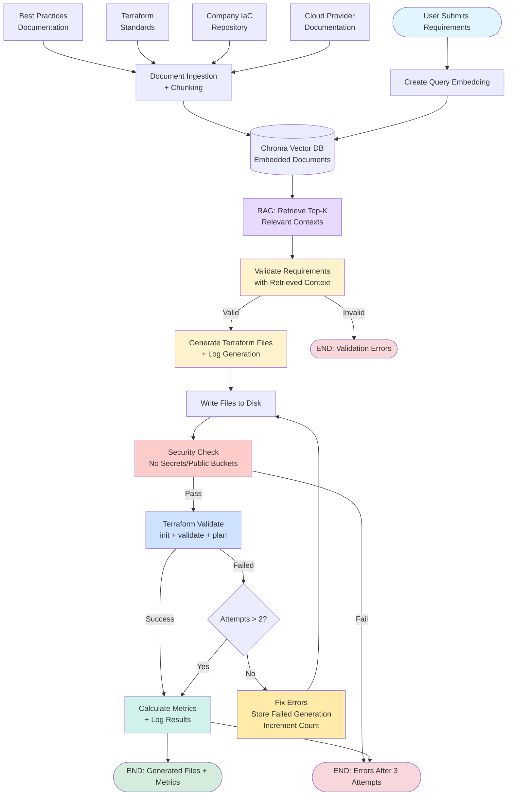

# IAC Agent Project

This project demonstrates agentic AI for generating infrastructure as code (IaC) using a tool-using agent approach. It is organized into several iterations, each showcasing a different agentic workflow for automating cloud infrastructure provisioning.

## Project Structure

```
code/
├── iac_agent/
│   ├── app.py
│   ├── core/
│   │   └── chat_interface.py
│   ├── tools/
│   │   └── calculator.py
│   ├── week3/
│   │   ├── factory.py
│   │   ├── part1.py
│   │   ├── part2.py
│   │   ├── part3.py
│   │   ├── prompts.py
│   │   └── workflow_state.py
│   └── ...
├── run.py
└── README.md
```

## Main Features

- **Agentic Infrastructure Generation:** Uses LLMs and custom agents to validate user requirements, generate Terraform files, and automate cloud provisioning.
- **Modular Design:** Each project iteration (part1, part2, part3) demonstrates a different agentic workflow, accessible via the factory pattern.

- **Logging:** Uses Python logging for traceability and debugging.

## Usage

1. **Install Dependencies**
   - This project uses [uv](https://docs.astral.sh/uv/) for fast, reliable Python package management.
   - Install uv if you haven't already:
     ```bash
     curl -LsSf https://astral.sh/uv/install.sh | sh
     ```
   - Install project dependencies:
     ```bash
     uv sync
     ```

2. **Install Terraform**
   - This project requires Terraform CLI for validating generated infrastructure code.
   - Install Terraform:
     - **macOS (Homebrew):**
       ```bash
       brew tap hashicorp/tap
       brew install hashicorp/tap/terraform
       ```
     - **Linux:**
       ```bash
       wget -O- https://apt.releases.hashicorp.com/gpg | sudo gpg --dearmor -o /usr/share/keyrings/hashicorp-archive-keyring.gpg
       echo "deb [signed-by=/usr/share/keyrings/hashicorp-archive-keyring.gpg] https://apt.releases.hashicorp.com $(lsb_release -cs) main" | sudo tee /etc/apt/sources.list.d/hashicorp.list
       sudo apt update && sudo apt install terraform
       ```
     - **Windows (Chocolatey):**
       ```bash
       choco install terraform
       ```
   - Verify installation:
     ```bash
     terraform --version
     ```

3. **Configure API Keys**
   - Set your OpenAI API key and base URL as environment variables:
     ```bash
     export OPENAI_API_KEY=your-key
     export OPENAI_API_BASE=https://api.openai.com/v1
     ```

4. **Run the Project**
   - Start the main application:
     ```bash
     uv run python code/run.py --week project --mode part1
     ```
   - You can select different project iterations using the factory in `iac_agent/agents/factory.py`.

## Project Iterations

### Part 1 - IaC Agent: 
Validates requirements and generates Terraform files using a tool-using agent with automatic Terraform validation.

**Terraform Validation Process**

Part1 automatically validates generated Terraform files through three stages:
1. **`terraform init`** - Initializes the Terraform working directory and downloads required providers
2. **`terraform validate`** - Validates the configuration syntax and internal consistency
3. **`terraform plan`** - Creates an execution plan to verify the configuration is deployable

If validation fails, the agent automatically attempts to fix errors up to 3 times before reporting failure.
  

### Part 2 - IaC Agent with RAG :
Demonstrates retrieval-augmented generation with agentic workflows to load the organization playbook to deploy
the infrastructure.



### Part3 - Performance and validation:
Enhance the performance and validate the terraform files to be ready for deployment on the infrastructure.

## Customization

- Extend agent workflows in `iac_agent/week3/` for new automation scenarios.

## License

MIT License

## Authors

- Rafy Amgad Benjamin
- Milad Afzal
- Contributors welcome!
